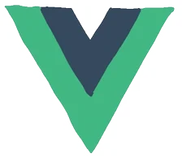

<!-- dynamic typing effect 动态打字效果 -->

    

 

# 🤺 About Me
&emsp;

&emsp;&emsp;Hello, I am Naixin.

&emsp;&emsp;Love Computer science and frontend.
 

&emsp;&emsp;<strong>We're making the world a better place. Through constructing elegant hierarchies for maximum code reuse and extensibility.</strong>

# Tech Stack

 

# Activity
<picture>
  <source media="(prefers-color-scheme: dark)" srcset="./profile-3d-contrib/profile-night-rainbow.svg" />
  <source media="(prefers-color-scheme: light)" srcset="./profile-3d-contrib/profile-gitblock.svg" />
  
</picture>

